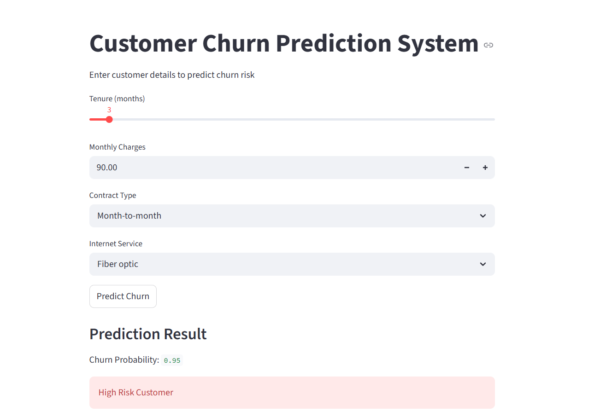

# 🚀 Customer Churn Prediction System

## 📌 Project Overview

This project builds a machine learning model to predict whether a telecom customer will churn (leave the service).
The goal is to help businesses identify high-risk customers and take proactive actions to retain them.

---

## 📊 Dataset

* Telco Customer Churn Dataset
* 7043 customers
* 21 features

Key features include:

* Tenure
* Monthly Charges
* Contract Type
* Internet Service

---

## ⚙️ Machine Learning Workflow

Data Cleaning
Exploratory Data Analysis (EDA)
Feature Engineering
Model Training
Model Evaluation
Feature Importance Analysis
Customer Risk Segmentation
Streamlit App Deployment

---

## 🤖 Models Used

| Model               | Accuracy |
| ------------------- | -------- |
| Logistic Regression | **0.81** |
| Random Forest       | 0.80     |

✅ Logistic Regression was selected because it has better recall for churn customers.

---

## 📈 Key Insights

* Customers with **month-to-month contracts** churn more
* Customers with **low tenure** are more likely to leave
* Higher **monthly charges** increase churn risk

---

## 💡 Business Recommendations

* Encourage long-term contracts
* Offer retention discounts to high-risk customers
* Improve early customer engagement

---

## 📊 Feature Importance

(Add your image here)

Example:

---

## 🧠 Customer Risk Segmentation

Customers are classified into:

* Low Risk (probability < 0.30)
* Medium Risk (0.30 – 0.70)
* High Risk (> 0.70)

---

## 🖥️ Streamlit App

Run the app locally:

streamlit run app/churn_app.py

---

## 📸 App Preview

(Take screenshot of your app and save as: visuals/churn_app_demo.png)

Then add:

---

## 📦 Tech Stack

* Python
* Pandas
* NumPy
* Scikit-learn
* Matplotlib
* Seaborn
* Streamlit
* Joblib

---
